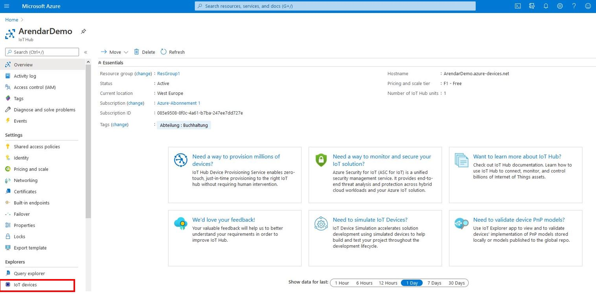
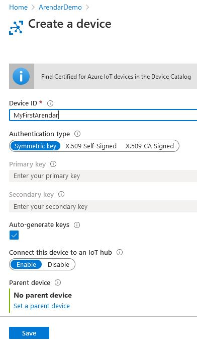
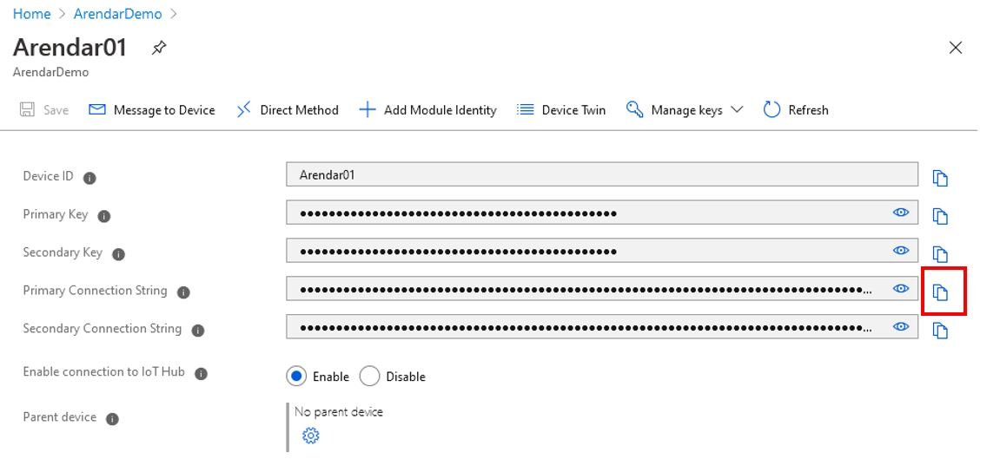
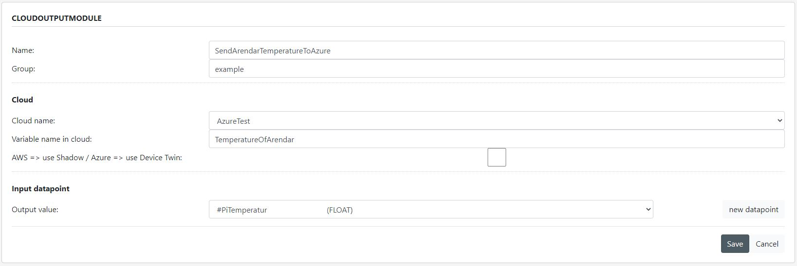
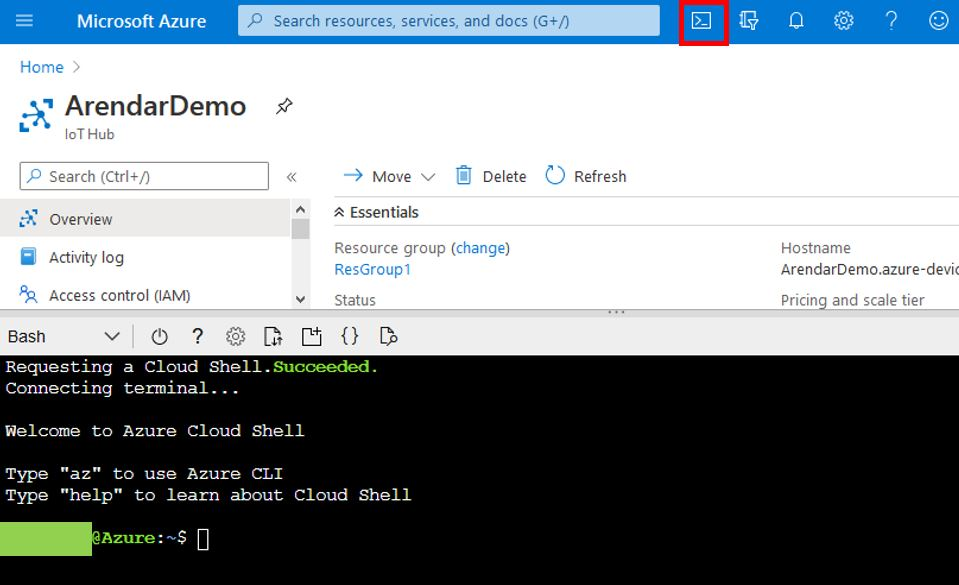
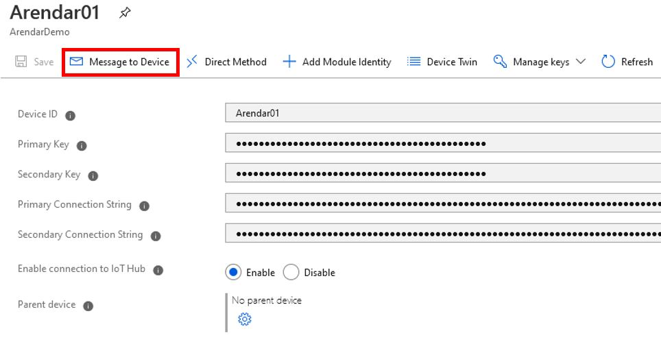
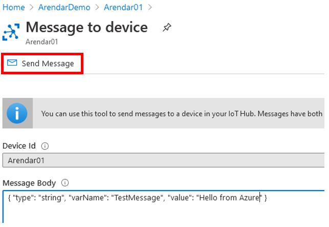

Run a simple C sample on Arendar device running Ubuntu Linux
===
---

# Table of Contents

-   [Introduction](#Introduction)
-   [Step 1: Configuring Azure IoT Hub](#Configure)
-   [Step 2: Configure Arendar](#ConfigureDevice)
-   [Step 3: Connection test with Azure IoT](#Test)
-   [References](#References)

# Introduction

**About this document**

This document describes how to connect your Arendar device running Ubuntu Linux with Azure IoT SDK. This multi-step process includes:

-   Configuring Azure IoT Hub
-   Configure your IoT device
-   Test your IoT device

**About the Arendar**

Developed according to the Security-by-Design-Principle our future-oriented product, the highly secure data collector ARENDAR, offers innovative features for the industry. The encrypted security IIoT gateway takes care of a secured separation of IT networks on the one hand while enabling data exchange between office and production on the other hand. Furthermore, the ARENDAR connects manufacturing executions systems and shop floor machinery, enables effective AI analyses on production data using data preprocessing, delivers information for predictive maintenance and offers a secure remote maintenance access.

The Arendar’s concept is to take input from external sources (PLCs, sensors, cloud services, …), which is then stored in datapoints, run functions on that data and send the results to external outputs (PLCs, actuators, cloud services, …).

# Step 1: Configuring Azure IoT Hub

In order to use Microsoft Azure you must at first create an Azure account and an IoT Hub resource.

**Note:** If you already have an Azure account and IoT Hub resource you can continue with step 1.3.

## 1.1 Create Azure account

Navigate your browser to <https://www.azure.com> and click the **Start free** button. On the next page click the **Start free** button again.

You will be prompted to log in with your Microsoft account. If you use for example Microsoft Office 365 you should already have an account. If you are not sure if you have an account please ask your system administrator.

Fill in your contact information and enter your phone number. Your phone number is necessary to verify your account by call or by SMS. You also need to provide a valid credit card. If you have filled all mandatory fields click the **Sign up** button.

It might take a few minutes until your account is ready to use.
If your Azure account has been created, click the **My Account** link at the top right corner or go to the Microsoft Azure Portal by using this link: <https://portal.azure.com/>

## 1.2 Create IoT Hub resource

If you are logged into Azure portal search for **IoT Hub**. Select **IoT Hub** from the search results and click **Create**.

Choose your **Subscription** and select your **Resource group** or create a new one.
Select the **Region** that is located next to your current location and define an **IoT Hub name**. Click on **Review + create**.

Confirm your entries, click **Create** and your IoT Hub will be deployed. This might take some minutes.

Next click on your new IoT Hub and you should see the following:

 

## 1.3 Create an IoT device in IoT Hub

Click on **IoT devices** in the left side menu as shown in above image and click on **New**.

 

Enter a **Device ID** of your choice, select **Symmetric key** as **Authentication Type**, tick **Auto-generate keys**, enable **Connect this device to an IoT Hub** and press **Save**.

Click **Refresh** in the **IoT Devices** screen and your new IoT device should be visible.

Click on your new IoT Device and click on the copy symbol next to **Primary Connection String** as shown below. Paste the content from your clipboard into a notepad for later usage.

 

# Step 2: Configure Arendar

Connect your Arendar to the network and power it on.

After some minutes the main display's background color will turn to green indicating that the Arendar is now ready.

Open your browser and navigate to **https://[enter the IP address of your Arendar here]** and login with your username and password.

## 2.1 Configure Cloud Provider

Click on **Configuration** in the top menu and then click on **Provider configuration** in the left side menu. In the provider section you can configure different connections to external systems/services like PLCs, MQTT brokers, OPC UA servers and Cloud services. Choose **Cloud** from the left side menu.

The screen shown below offers you the ability to add new connections to cloud services as well as editing, copying or removing existing cloud connections. Choose **Microsoft Azure** in the drop-down list and click on **new Cloud connection**.

 

Enter a **Name** for your new cloud connection and paste the **Connection string** that you copied in Step 1.3. All other values can stay at their default values.

Press **Save**.

 

The Cloud Provider only contains connection information. To specify how data is sent or received from Azure you also need a Cloud Input or Output Module. This will be explained in the next step.

## 2.2 Configure Cloud Input/Output Module

Click on **Configuration** in the top menu and on **Application configuration** in the left side menu. Choose **Modules** from the left side menu. This section offers you the ability to add new modules as well as editing, copying or removing existing modules. Choose **CloudOutputModule** in the drop-down list and click on **new Module**. The CloudOutputModule is used to send datapoints from the Arendar to Azure.

Enter a **Name** that describes what this module’s task is and choose a **Group** for this module. The group function allows to organize large number of modules into smaller groups. Select the **Cloud name** that you created before

Define a **Variable name in cloud** that is used in the message sent to Azure.

If you want to use Azure's device twin functionality instead of normal device-to-cloud messages tick the check box **use Device Twin**. For more information about device twins see [References](#References).

As **Input datapoint** you specify which internal datapoint of the Arendar will be mapped to the datapoint in Azure. In this example it is a datapoint containing the current temperature value of the device.

 

Press **Save**.

If you configured the Cloud Output Module like this the Arendar will send the following Json Message to Azure:

    { "type": "number", "varName": "TemperatureOfArendar", "value": 36.4 }

The Cloud Input Module is configured in the same way as the Cloud Output Module. The only difference is that the input module is used to receive data from Azure.

**Note:** The Cloud Input Module automatically detects if a variable is received from Azure via normal cloud-to-device message or via device twin update, so there is no **use Device Twin** checkbox.

**Note:** If you want to synchronize an Arendar datapoint with Azure's device twin functionality you need to specify a Cloud Input Module that uses the same datapoint as the Cloud Output Module.

# Step 3: Connection test with Azure IoT

## 3.1 Incoming messages

Navigate your brwoser to your IoT Hub and click on the console icon in the top menu and a console will appear as shown below.

 

Enter the following command in the console and replace the hub name with your hub name:

    az iot hub monitor-events --hub-name ArendarDemo --output table

The incoming temperature messages from the Arendar should be displayed in the console after some seconds.

## 3.2 Outgoing messages

You can send messages from Azure to your Arendar by selecting your IoT device in IoT Hub and clicking on **Message to Device**.

 

Enter a **Message Body** in Json format and click **Send Message**.

 

# References

For a better understanding of Azure IoT and Azure device twins you can check the following Microsoft online documentation:

-   [Azure IoT Hub Documentation]
-   [Azure IoT Hub Developer Guide]
-   [Azure Device Twins]

[Azure IoT Hub Documentation]:
https://docs.microsoft.com/de-de/azure/iot-hub/about-iot-hub
[Azure IoT Hub Developer Guide]:
https://docs.microsoft.com/de-de/azure/iot-hub/iot-hub-devguide
[Azure Device Twins]:
https://docs.microsoft.com/en-us/azure/iot-hub/iot-hub-devguide-device-twins

